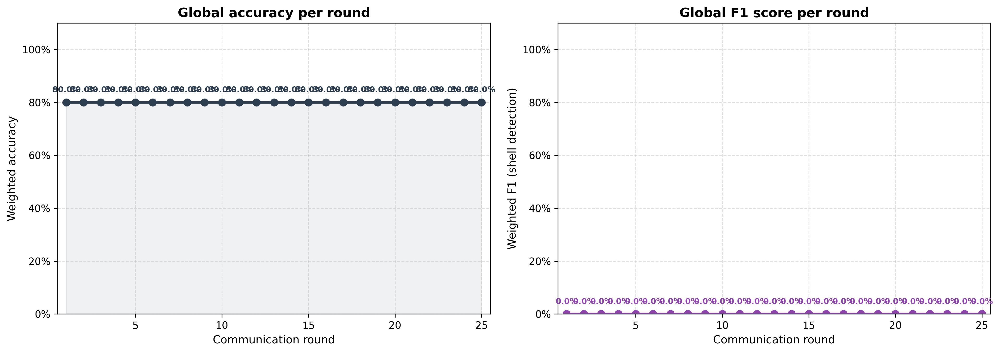
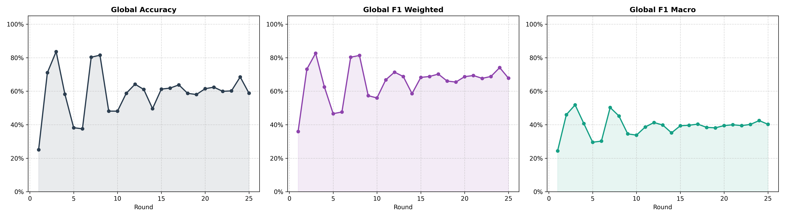

# Trade‑Based AML (TBML) — Memgraph + Kafka + Federated Learning

<p align="center">
  
  
</p>

A **trade‑based anti‑money‑laundering detection system** using:
- **Memgraph** (one graph DB per bank)
- **Flower (FLWR)** for **federated learning** (weights move, data stays)
- **Kafka** for real‑time transaction events
- A **PyTorch + PyTorch Geometric** model that fuses KYC + SWIFT + Trade‑doc signals

> [!IMPORTANT]
> This repo is configured for a **Memgraph‑only** pipeline. Large datasets in `Banks/` are intentionally **not** pushed to GitHub (GitHub blocks files > 100MB).

---

## Table of contents

- [Architecture](#architecture)
- [Prerequisites](#prerequisites)
- [Quick start](#quick-start)
- [Step-by-step setup](#step-by-step-setup)
  - [1) Start Kafka](#1-start-kafka)
  - [2) Start Memgraph (3 banks)](#2-start-memgraph-3-banks)
  - [3) Provide bank datasets (local only)](#3-provide-bank-datasets-local-only)
  - [4) Ingest data into Memgraph](#4-ingest-data-into-memgraph)
  - [5) Federated training (Flower)](#5-federated-training-flower)
  - [6) Real-time inference with Kafka](#6-real-time-inference-with-kafka)
- [Configuration](#configuration)
- [Notes / Troubleshooting](#notes--troubleshooting)
- [Key files](#key-files)

---

## Architecture

```mermaid
flowchart LR
  subgraph BankA[Bank A]
    MGA[(Memgraph :4000)]
    CA[client.py --bank banka]
    CA -->|query subgraphs| MGA
  end

  subgraph BankB[Bank B]
    MGB[(Memgraph :4001)]
    CB[client.py --bank bankb]
    CB -->|query subgraphs| MGB
  end

  subgraph BankC[Bank C]
    MGC[(Memgraph :4002)]
    CC[client.py --bank bankc]
    CC -->|query subgraphs| MGC
  end

  S[server.py (Flower server :8085)]
  CA -->|model weights| S
  CB -->|model weights| S
  CC -->|model weights| S
  S -->|global_model.npz| W[(Weights)]

  K[(Kafka broker :19092)]
  T[trigger.py] -->|topic: incoming_swift_messages| K
  I[inference.py] -->|consume topic + fetch context| K
  I --> MGA
  I -->|predict| OUT[CLEAN / REVIEW / STR]
```

---

## Prerequisites

- Linux (tested) / macOS
- Python 3.9+
- Docker + Docker Compose

Python packages used by the code:
- `flwr`, `torch`, `torch-geometric`, `pandas`, `numpy`, `neo4j` (Bolt driver), `kafka-python`, `scikit-learn`

> [!TIP]
> PyTorch Geometric must match your PyTorch + CUDA/CPU build. Install PyTorch first, then install PyG for your platform.

---

## Quick start

If you already have the `Banks/` data available locally:

1. Start Kafka
2. Start 3 Memgraph instances
3. Ingest `Banks/Bank_A|B|C` into Memgraph
4. Train: run `server.py` + 3× `client.py`
5. Run `inference.py` and fire an event with `trigger.py`

---

## Step-by-step setup

## 1) Start Kafka

This repo includes [docker-compose.yml](docker-compose.yml) which exposes Kafka on **`localhost:19092`**.

1. Create the docker network (only needed once):

```bash
docker network create major_project_network
```

2. Start Kafka:

```bash
docker compose up -d
```

---

## 2) Start Memgraph (3 banks)

Run **three** Memgraph instances locally (one per bank), each exposing Bolt on ports `4000`, `4001`, `4002`.

Example using `memgraph/memgraph-platform` (includes Memgraph + UI):

```bash
# Bank A
docker run -d --name memgraph_banka \
  -p 4000:7687 -p 3000:3000 \
  memgraph/memgraph-platform

# Bank B
docker run -d --name memgraph_bankb \
  -p 4001:7687 -p 3001:3000 \
  memgraph/memgraph-platform

# Bank C
docker run -d --name memgraph_bankc \
  -p 4002:7687 -p 3002:3000 \
  memgraph/memgraph-platform
```

> [!NOTE]
> Memgraph UI (optional):
> - Bank A: http://localhost:3000
> - Bank B: http://localhost:3001
> - Bank C: http://localhost:3002

---

## 3) Provide bank datasets (local only)

The large datasets folder `Banks/` is **ignored** by git (see [.gitignore](.gitignore)).

Expected layout:

```text
Banks/
  Bank_A/
    kyc.csv
    swift.csv
    trade.csv
  Bank_B/
    kyc.csv
    swift.csv
    trade.csv
  Bank_C/
    kyc.csv
    swift.csv
    trade.csv
```

---

## 4) Ingest data into Memgraph

Ingest all 3 banks into their respective Memgraph instances:

```bash
python neo4j_ingestion.py
```

If your `Banks/` folder is somewhere else:

```bash
export BANKS_DIR=/absolute/path/to/Banks
python neo4j_ingestion.py
```

---

## 5) Federated training (Flower)

1. Start the federated server:

```bash
python server.py
```

2. In **three separate terminals**, start one client per bank:

```bash
python client.py --bank banka
python client.py --bank bankb
python client.py --bank bankc
```

After training finishes, the server writes:
- `global_model.npz`

---

## 6) Real-time inference with Kafka

1. Start inference:

```bash
python inference.py
```

2. Send an event (publishes to topic `incoming_swift_messages`):

```bash
python trigger.py
```

---

## Configuration

| Item | Default | Where |
|---|---:|---|
| Kafka broker | `localhost:19092` | `KAFKA_BROKER` env var or code defaults |
| Kafka topic (inference) | `incoming_swift_messages` | [inference.py](inference.py) / [trigger.py](trigger.py) |
| Memgraph Bank A | `bolt://localhost:4000` | [client.py](client.py), [inference.py](inference.py), [trigger.py](trigger.py) |
| Memgraph Bank B | `bolt://localhost:4001` | [client.py](client.py) |
| Memgraph Bank C | `bolt://localhost:4002` | [client.py](client.py) |

---

## Notes / Troubleshooting

> [!WARNING]
> If Kafka is running somewhere else (e.g. local install on `9092`), set:
>
> ```bash
> export KAFKA_BROKER=localhost:9092
> ```

- `Banks/` is not pushed to GitHub because GitHub blocks files over 100MB.
- Older Neo4j demo scripts remain in the repo but are not required for the Memgraph-only pipeline.

---

## Key files

- Federated server: [server.py](server.py)
- Federated client: [client.py](client.py)
- Model definition: [model.py](model.py)
- Memgraph ingestion: [neo4j_ingestion.py](neo4j_ingestion.py)
- Real-time inference: [inference.py](inference.py)
- Kafka trigger (event producer): [trigger.py](trigger.py)
