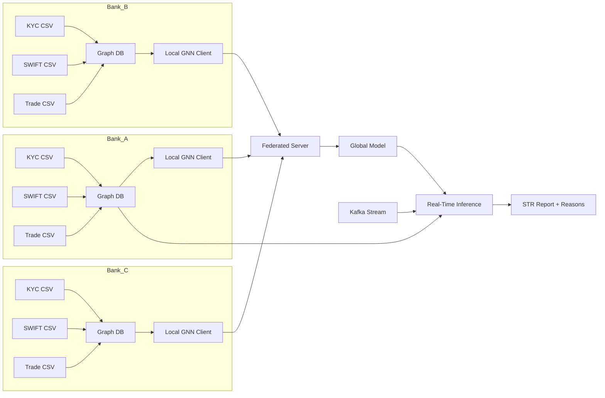

# TBML Detection Architecture

## Overview
This system detects trade-based money laundering using three isolated bank datasets: Bank_A, Bank_B, and Bank_C. Each bank owns its own graph data and local training flow, while a federated server aggregates model updates without moving raw data across silos.

The architecture is built around three goals:
- classify suspicious transactions accurately
- generate STRs with grounded reasons
- preserve bank-level data isolation

## Core Design

## Data Layer

### Bank datasets
Each bank contains three source files:
- `kyc.csv`
- `swift.csv`
- `trade.csv`

### Graph storage
The ingestion pipeline converts these CSVs into a graph with:
- `Account` nodes for KYC entities
- `Transaction` nodes for SWIFT messages
- `Document` nodes for trade documents

### Relationships
- `Account -> Transaction` via `SENDS`
- `Transaction -> Account` via `TO`
- `Transaction -> Document` via `HAS_DOC`

This structure is the basis for topology-based fraud detection.

## Model Layer

### Local GNN
Each bank trains its own model on local graph data.
The model combines:
- graph topology from sender/receiver relationships
- temporal transaction context
- trade anomaly features

### Suggested learning target
The model should predict risk at the `Transaction` level:
- `0 = CLEAN`
- `1 = SUSPICIOUS`
- `2 = FRAUD`

### Why a graph model
A graph model is useful because TBML often appears as:
- layered transfers
- fan-out / fan-in behavior
- repeated use of related entities
- suspicious trade documents linked to abnormal payment activity

## Federated Learning Layer

### Purpose
Banks do not share raw data. They only share model updates.

### Flow
1. Each bank trains locally on its own graph.
2. The server collects model weights.
3. The server averages the updates.
4. The global model is sent back to clients.

### Benefit
This allows cross-bank learning while preserving data isolation.

## Real-Time Inference Layer

### Inputs
The inference pipeline consumes:
- Kafka transaction messages
- bank graph context from the graph database
- the latest global federated model

### Inference steps
1. Read incoming SWIFT message from Kafka.
2. Fetch sender, receiver, and trade context from the graph.
3. Build model tensors from KYC, SWIFT, and trade signals.
4. Run the GNN classifier.
5. Apply heuristic checks for explicit TBML patterns.
6. Generate the final decision.
7. Write an STR report back into the graph.

## STR Reasoning Layer

The STR should not rely only on the model class label. It should include evidence-based reasons drawn from the input features.

### Example reason sources
- `is_shell = 1`
- `dorm_days > threshold`
- `device_entropy` unusually high or low
- `price_deviation` far from market average
- `weight_gap_score` indicates mismatch
- `ais_status = DARK`
- high transaction fan-out from the sender

### STR output fields
- transaction id
- predicted class
- confidence score
- model version
- heuristic breakdown
- human-readable reasons
- timestamp

## Recommended Production Boundaries

### 1. Ingestion service
Owns CSV to graph loading and schema validation.

### 2. Federated training service
Owns local training and server aggregation.

### 3. Streaming inference service
Owns Kafka consumption, scoring, and STR creation.

### 4. Audit storage
Owns persistent STR records and model metadata.

## Implementation Principles

- Keep raw bank data inside the bank silo.
- Use the graph database for both training context and inference context.
- Use the GNN for classification, not for free-text explanation.
- Use rule-based evidence extraction for STR reasons.
- Version every model checkpoint.
- Store confidence and explanation metadata with every alert.

## Minimal End-to-End Flow

1. Load Bank_A, Bank_B, and Bank_C data.
2. Build graphs from KYC, SWIFT, and trade files.
3. Train local bank models.
4. Aggregate global weights with federated averaging.
5. Stream live transactions through Kafka.
6. Score each transaction using the latest global model.
7. Generate STRs for suspicious or fraudulent activity.

## Suggested Model Philosophy

For this project, the cleanest design is:
- graph encoder for network behavior
- trade encoder for TBML evidence
- fusion layer for final risk scoring
- explanation engine for STR reasons

This keeps the model accurate and the STR defensible.
